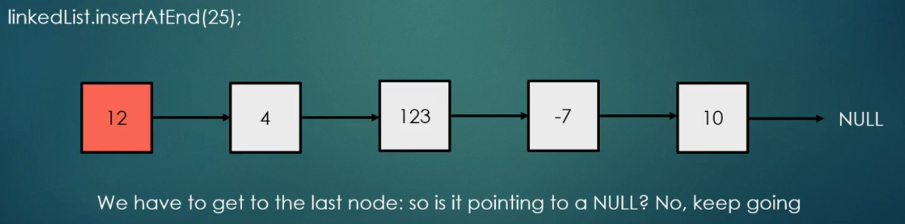

# data_structures_python
Data Structures in Python

# Linked Lists 

Linked lists are composed of nodes and references / pointers which point from one node to the other.

The last node in a linked list always points to a null:


A single node:

 | Data | 
| ------------- | 
| Reference  |


- contains data -> integer, double or custom object
- contains a reference pointing to the next node in the linked list

The below is pseudo code illustrates a node below:
```
class Node {

  data
  Node nextNode
  ...
 }
 ```
- Each node is composed of a data and a reference/link to the next node in the sequence
- Simple and very common data structure
- They can be used to implement several other common data types: stacks, queues
- Simple linked lists by themselves **do not allow for random access to the data** //
so we can use indecies: getitem(int index)
- Many basic operations such as obtaining the last node of the list, finding a node that contains certain data or locating the place where the node should be inserted require sequential scanning of most of all of the list elements.

## Advantages
- Linked lists are dynamic data structures ( arrays are not )
- It can be allocated the needed memory at run-time
- Very efficient if we want to manipulate the first elements
- Easy implementation
- Can store items with different sizes: an array assumes every element to be exactly the same
- It's easier for a linked list to grow organically. An array's size needs to be known ahead of time, or re-created when it needs to grow.

## Disadvantages
- Waste memory because of the references ( reference is required in each node )
- Nodes in a linked list must be read in order from the beginning as linked list have sequential access ( array items can be reached via indexes **O(1)** time complexity
- Difficulties arise in linked lists when it comes to reverse traversing. Singly linked lists are extremely difficult to navigate backwards.
- Soulution: doubly linked lists -> easier to read, but memory is wasted in allocating space for a back pointer.

# Operations

## insertion

Inserting items at the beginning of the linked list: very simple, we just have to update the references -> **O(1)** time complexity

```
linkedList.insertAtStart(-5);
```


- This operation is very fast! This is why we like linked list
- For arrays, this operation would be **O(N)** -> linear time complexity

**Recap**
- We like arrays because of the random access; we can insert items at the end of the list very fast **O(1)** time complexity
- We like linked lists because we can insert items very fast at the beginning **O(1)** time complexity

Inserting items at the end of linked list: not simple; we have to traverse the whole linked list to find the last node.

How do we find the last node? **We know the last node is pointing to a null.**

Also, we have to update the references when we get there: **O(N)** time complexity.

## Insertion: continued

```
linkedList.insertAtEnd(25):
```


Finally, at 10, we are pointing to a null, so we can insert 25 after 10:

Updating the references takes **O(1)** time complexity. **But**, we have to traverse the list itself which takes **O(N) // **O(N) + O(1) = O(N)**

**Insert for Linked List:**
Insert at the beginning **O(1)**
Insert at the end **O(N)**

## Remove

#### Let's say we want to remove the first item, or the root of the linked list:
```
linkedList.removeStart()
```

This is fast as simple as we just remove the root node.


### If we want to remove an item at a given index:

```
linkedList.remove(10)
```

We can access the root node only, if we want to remove an item at a specific index, we must traverse the entire list until we find it:

**O(N)** linear time complexity

**Remove for Linked List:**
Remove at the beginning **O(1)**
Remove items at a given index **O(N)**


