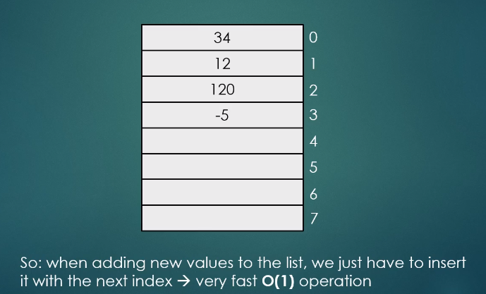
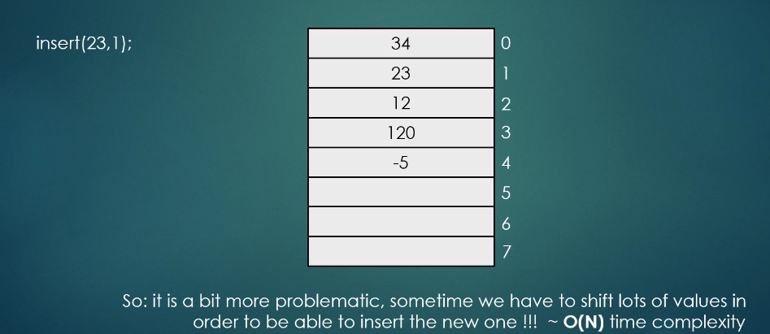

# data_structures_python
Data Structures in Python

# Arrays: data sctructures

A collection of elements / values each identified by an array index or key.

- Index starts at zero
- Thanks to the indecies: random access is possible
  - We are able to access all and any element of the array

| Index  | Numbers[] |
| ------------- | ------------- |
| 0  | 34  |
| 1  | -12 |
| 2  | 2   |
| 3  | 300 |
| 4  | -45 |
| 5  |  0  |
| 6  | 5   |
| 7  |  1  |

```
numbers[4] = -45
```

## Multidimensional Arrays

Can prove to be very important in mathematical related computations ( matrices ):


numbers [][] two deminsional array

First parameter: row index
Second parameter: column index

## More on Arrays

- Arrays are data structures used to store items of the same type
- We use indicies as keys
- Arrays can have as many deminsions as we want: one or two dimensional arrays are quite popular
- Example: storing a matrix → two dimensional array
- Dynamic array: when the size of an array is changing dynamicallly
- Applications: **lookup tables / hashtables, heaps**

## Advantages
- We can use random access because of the keys: 
```
getitem(int index)
```
This will return the value with the given key very fast: **O(1)**
- Very easy to impliment and to use
- Very fast data structure
- We should use arrays in applications when we want to add items over and over again and we want to take items with given indecies - this will be fast!

## Disadvantages

- We have to know the size of the array at compile-time: so it is not such a dynamic data structure
- If it is full: we have to create a bigger array and thne copy the values one-by-one // reconstructing an array is an **O(N)** operation
- It is not able to store items with different types

## Operations

**Add**
We can keep adding values to the array as long as the array is not full



If we insert items at the end of the array, speed is very fast

**insert(23, 1)**

With the above, we must move the values from 1 to 2 and so on. 



This gives us linear time complexity - we have to move n number of items on an array in order to make space from the item we want to insert.
